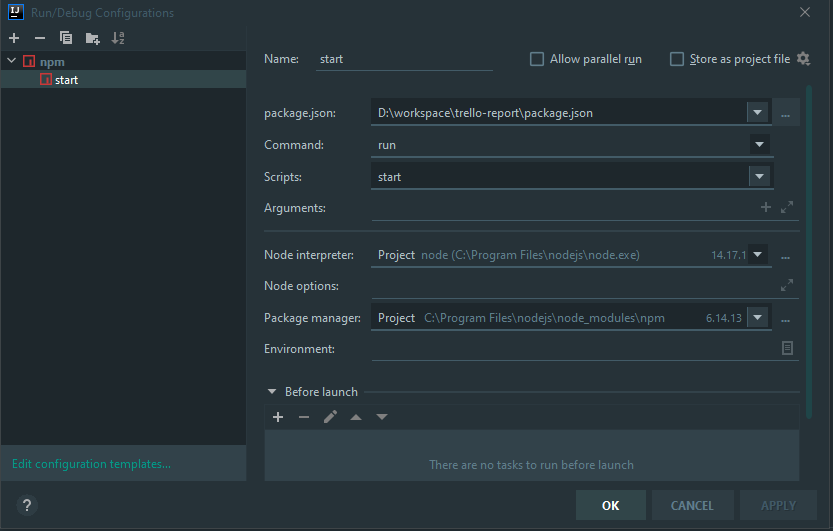

# Nodejs (v14.17.1 for example) Trello monthly report

- Run `npm ci`
- [Trello API Docs](https://developer.atlassian.com/cloud/trello/guides/rest-api/api-introduction/)
- Here you can find your own personal [TRELLO_API_KEY](https://trello.com/app-key)
- Need get trello token at [api key](https://trello.com/1/authorize?expiration=1day&name=MyPersonalToken&scope=read&response_type=token&key={TRELLO_API_KEY}). It will be valid for 1 day.
- Add trello token to `.env` as `TRELLO_TOKEN`
- Fill up all your own `.env` file according to [example.env](example.env)
- Run `npm run start`
- If any errors occurs during process you may debug like this at IDEA 
- if everything is OK, the report will be generated at `/dist/folder/webapss_report_CURRENT_DATE.xlsx`
